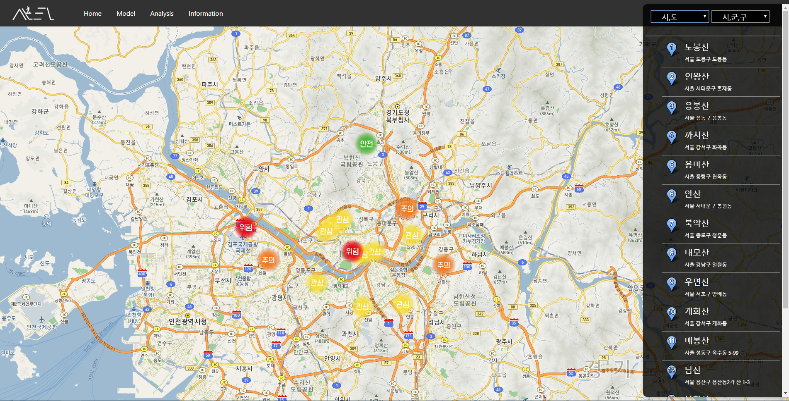

# Mountain Risk prediction System
with **Team SANTA**

## 활용데이터

* 2010년~2018년까지의 산악 사고 데이터 84,771건
* 2010년~2018년까지의 시간 별 날씨 데이터 약 700만건

## 프로젝트 요약

### 1. 데이터 수집 및 전처리
  + 공공데이터포털에서 날씨, 사고데이터 수집
  + 결측데이터/이상데이터 처리
  + 날씨데이터는 Feature selection을 통한 전처리

### 2. 모델 생성  
  + 현재 날씨에 따라 산 별 위험도를 측정하는 분류 모델(Neural Network)을 생성
    + input  : 날씨 데이터
    + output : 사고데이터에 labeling 되어있는 사고 종별로 분류

### 3. 위험도 계산식
=𝑝𝑒𝑟𝑐𝑒𝑛𝑡𝑖𝑙𝑒_𝑟𝑎𝑛𝑘( 
{(𝑃(𝐶𝑎𝑠𝑒2) ∗ 𝑃(𝑃𝑎𝑠𝑡_𝐶𝑎𝑠𝑒2│𝑃𝑎𝑠𝑡_𝑎𝑐𝑐𝑖𝑑𝑒𝑛𝑡)  
+𝑃(𝐶𝑎𝑠𝑒3) ∗ 𝑃(𝑃𝑎𝑠𝑡_𝐶𝑎𝑠𝑒3│𝑃𝑎𝑠𝑡_𝑎𝑐𝑐𝑖𝑑𝑒𝑛𝑡))  
/𝑃(𝐶𝑎𝑠𝑒1)} ∗ 𝑤𝑒𝑖𝑔ℎ𝑡 )

* 𝐶𝑎𝑠𝑒1:산악사고와 무관한 사고,  𝐶𝑎𝑠𝑒2:날씨와 관련된 사고,  𝐶𝑎𝑠𝑒3:산악사고
* 𝑃(𝑃𝑎𝑠𝑡_𝐶𝑎𝑠𝑒2│𝑃𝑎𝑠𝑡_𝑎𝑐𝑐𝑖𝑑𝑒𝑛𝑡):과거 사고에 대한 상대적 𝐶𝑎𝑠𝑒2 발생 비율
* 𝑃(𝑃𝑎𝑠𝑡_𝐶𝑎𝑠𝑒3│𝑃𝑎𝑠𝑡_𝑎𝑐𝑐𝑖𝑑𝑒𝑛𝑡):과거 사고에 대한 상대적 𝐶𝑎𝑠𝑒3 발생 비율
* 𝑤𝑒𝑖𝑔ℎ𝑡:전국 17개 시,도 별 산악사고 발생 비율에 따른  가중치 

### 4. 웹시스템 개발
  + Flask로 웹 개발
  + Kakao Map API를 활용해 산 위치 별 위험도 표시 
  + plotly-dash를 활용한 데이터 시각화
  + tensorspace를 활용한 모델 시각화
  
  

